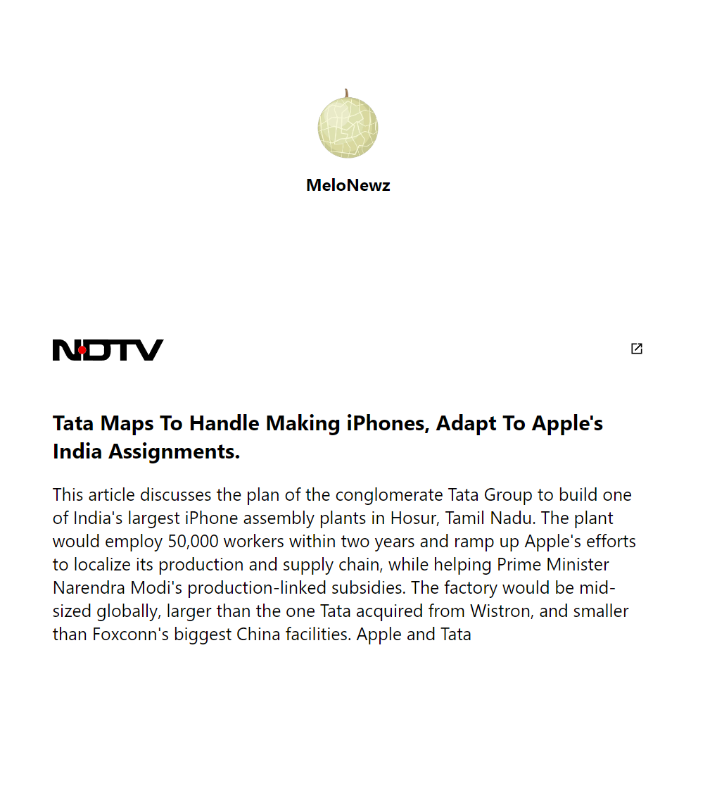

# MeloNewz

MeloNewz is a browser extension that transforms your news reading experience on ndtv.com. With a seamless integration of cutting-edge technologies, MeloNewz adds a unique twist to headlines and articles, making news consumption more engaging.

## Usage

1. **Installation:**
   - Install the MeloNewz extension in your browser.

2. **Visit ndtv.com:**
   - Navigate to `ndtv.com/<news-detail-page>`.

3. **Activate the Extension:**
   - Switch on the MeloNewz extension.

4. **Transformed Content:**
   - Witness a creative and personalized transformation of headlines and articles right on the ndtv.com page.

5. **View Transformed News:**
   - Click on the "View" button to explore the transformed news in a separate, user-friendly interface.

## Screenshots

\
*Caption: Install extension.*

\
*Caption: Switch on extension.*

\
*Caption: Transformed news article on ndtv.com.*

\
*Caption: View sharable news at separate ui*

## Technology Stack

MeloNewz leverages a robust technology stack to deliver its innovative features:

- **Node.js Express:** Backend framework for server-side operations.
- **HTML, CSS, JS:** Standard web technologies for building the user interface.
- **OpenAI:** Harness the power of OpenAI for generating rhymes and providing bias summaries.

Experience news in a whole new way with MeloNewz!

Feel free to contribute, report issues, or share your thoughts. Happy reading!
